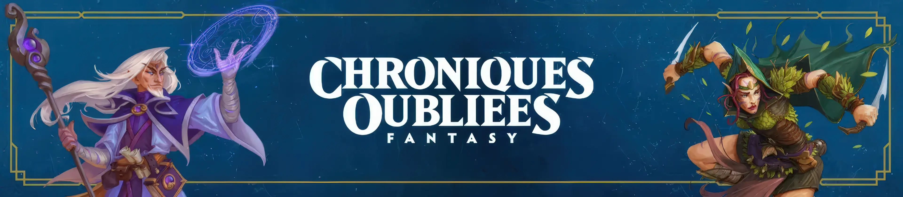

<h2 align="center">Système <em>Chroniques Oubliées 2</em> pour Foundry VTT</h2>

Ce système vous permet de jouer au jeu de rôle "<em>Chroniques Oubliées</em>" sur la plateforme de jeu Foundry Virtual Tabletop.

    
     
    
     

<h2>Contributeurs</h2>
<ul>
<li>Merci à Kristov d'avoir porté le projet sur la durée.</li>
<li>Merci à Caloup pour avoir contribué au système ces derniers mois, et créé une grande partie des items et acteurs du module.</li>
<li>Merci à l'Alchimiste pour les tests, les changements de css, et la création du guide du système.</li>
<li>Merci à LionelL2 pour la refonte de la structure less et css, et le design des interfaces.</li>
<li>Merci à tous les autres testeurs et contributeurs (Ganodor, Khamûl, Sigrhild, Stany) qui ont aidé à peaufiner la version actuelle du système.</li>
<li>Merci à Zigmund pour avoir été là au tout début de la création de ce système.</li>
</ul>

<h2>Mentions Légales</h2>
© Black Book Éditions, 2025. Chroniques Oubliées Fantasy est une marque déposée par Black Book Éditions. Tous droits réservés.

<h2>Communauté</h2>

Rejoignez-nous sur le serveur <a href="https://discord.com/invite/pPSDNJk">Discord francophone dédié à Foundry Virtual Tabletop</a>

Nous serons ravis d'avoir vos retours sur le système, des signalements de bug, des idées d'amélioration, ou simplement des encouragements !

<h2>Licences</h2>
<ul>
<li>Le code HTML, CSS et Javascript de ce projet est placé sous <a href="https://choosealicense.com/licenses/gpl-3.0/">licence GNU General Public License v3.0</a></li>

<li>Le support de Foundry VTT est couvert par la licence suivante : <a href="https://foundryvtt.com/article/license/">Accord de licence limitée pour le développement de modules du 17/02/2021</a>.</li>
</ul>
